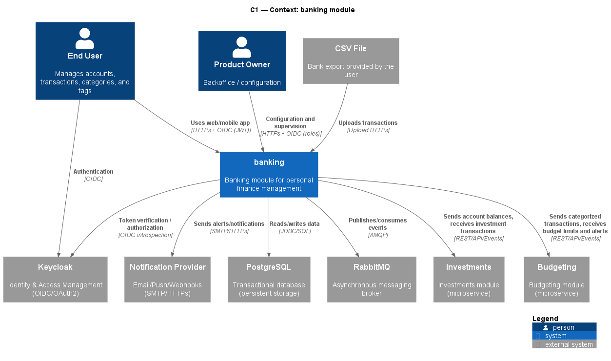
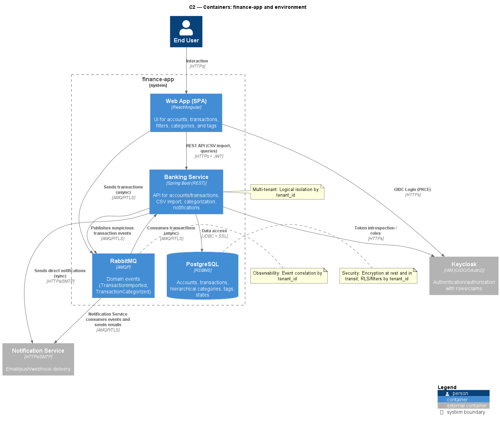
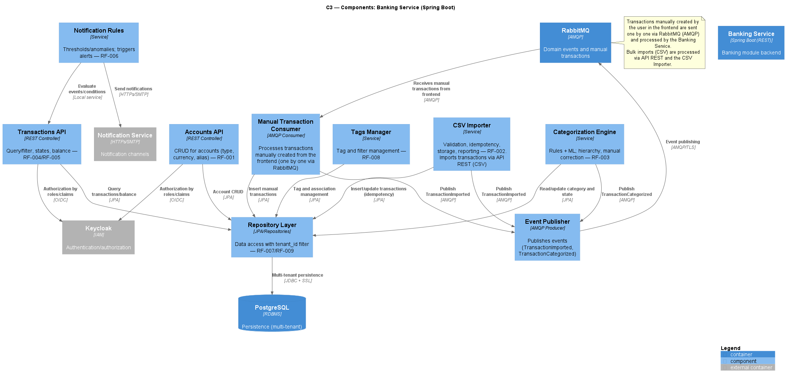

# BANKING TECHNICAL DESIGN DOCUMENT

## 1. INDEX

1. Technical Summary
2. Architecture (C4: Context, Container, Component)
3. Keycloak Integration (authZ/authN)
4. Data Model (Postgres, Flyway)
5. API and Contracts (REST)
6. Business Logic (categorization, idempotency)
7. Technical Security
8. Configuration and Deployment (Docker, Compose)
9. Observability (Actuator, metrics, logs)
10. Testing (unit, integration, E2E)
11. Migration and Data (seeds, backup)
12. Technical Risks
13. Plan / Roadmap
14. ADRs (references)

## 1. Technical Summary

The Banking module is a backend service developed with Spring Boot (Java 21, Spring Boot 4.x) that manages users' bank accounts and transactions. It uses a PostgreSQL database for persistent storage, with migrations managed by Flyway. Authentication and authorization are handled via Keycloak, integrating as an OAuth2 Resource Server.

The service exposes a RESTful API for interaction with other modules and the frontend, and uses RabbitMQ for asynchronous messaging. Environment configuration is managed via .env files and Docker Compose to facilitate deployment and service orchestration.

## 2. Architecture (C3: Context, Container, Component)

### Context

The Banking module is part of the "finance-app" application, which follows a microservices architecture. It interacts with the following modules and external systems:

- **API Gateway**: All requests from end users and backoffice/admins are routed through the API Gateway, which handles security, routing, and rate limiting. The frontend (Web/Mobile App) communicates with the Banking module via the Gateway using HTTPs.

- **Identity Service (Keycloak)**: Provides authentication and authorization (OIDC/OAuth2). The Banking module validates tokens and roles with Keycloak for all incoming requests.

- **Notification Service**: Receives events from Banking (via RabbitMQ) and sends notifications (email, push, webhook) to users.

- **PostgreSQL**: Dedicated transactional database for persistent storage of accounts, transactions, categories, tags, and states.

- **RabbitMQ**: Asynchronous messaging/event bus. Banking both publishes and consumes events (e.g., TransactionImported, TransactionCategorized, suspicious transactions). Used for integration with Notification Service and for decoupling with other modules.

- **CSV File**: Users can import transactions via CSV uploads, which are processed by the Banking module.

- **Investments Service**: Receives account balances from Banking and sends investment transactions. Integration via REST API and events.

- **Budgeting Service**: Receives categorized transactions from Banking and provides budget limits and alerts. Integration via REST API and events.

**Actors:**

- **End User**: Manages accounts, transactions, categories, and tags via the frontend (Web/Mobile App).
- **Product Owner / Admin**: Accesses backoffice features for configuration and supervision, also via the frontend and API Gateway.

**Main flows:**

- End users and admins authenticate via Keycloak and interact with the Banking module through the API Gateway.
- Users can upload CSV files for transaction import (sync) or send transactions asynchronously via RabbitMQ.
- The Banking module reads/writes data in PostgreSQL, publishes/consumes events in RabbitMQ, and interacts with Notification, Investments, and Budgeting services as needed.

### Containers

El Banking module se ejecuta como una aplicación Spring Boot (REST) dentro de un contenedor Docker, formando parte del sistema "finance-app". La arquitectura de contenedores, según el diagrama C4, es la siguiente:

- **Web App (SPA)**: Aplicación frontend que permite a los usuarios gestionar cuentas, transacciones, filtros, categorías y etiquetas. Se comunica con Keycloak para login OIDC (PKCE) y con el Banking Service vía REST API (HTTPs). También puede enviar transacciones de forma asíncrona a RabbitMQ (AMQP/TLS).

- **Banking Service**: Servicio Spring Boot (REST) que expone la API para cuentas, transacciones, importación de CSV, categorización y notificaciones. Consume transacciones desde RabbitMQ (async), publica eventos de transacciones sospechosas y envía notificaciones directas (HTTPs/SMTP) al Notification Service. Realiza introspección de tokens y roles con Keycloak.

- **PostgreSQL**: Base de datos relacional (RDBMS) para cuentas, transacciones, categorías jerárquicas, etiquetas y estados. Seguridad reforzada: cifrado en reposo y en tránsito, y Row-Level Security (RLS) por tenant_id.

- **RabbitMQ**: Bus de eventos (AMQP) para eventos de dominio como TransactionImported y TransactionCategorized. Permite correlación de eventos por tenant_id para observabilidad.

- **Keycloak**: Servicio externo de IAM (OIDC/OAuth2) para autenticación/autorización, gestionando roles y claims. El Banking Service valida tokens y roles contra Keycloak.

- **Notification Service**: Servicio externo que consume eventos desde RabbitMQ y envía notificaciones por email, push o webhook (HTTPs/SMTP).

**Notas de arquitectura:**

- Multi-tenant: Aislamiento lógico por tenant_id en todos los datos y eventos.
- Seguridad: Cifrado en tránsito y en reposo, RLS en base de datos, validación de roles vía Keycloak.
- Observabilidad: Correlación de eventos por tenant_id, métricas y logs estructurados.

### Components

The Banking Service is composed of the following main internal components (see C4 Component diagram):

- **Accounts API (REST Controller):** Handles CRUD operations for accounts (type, currency, alias).
- **Transactions API (REST Controller):** Handles querying/filtering of transactions, state management, and balance calculation.
- **CSV Importer (Service):** Responsible for validating, deduplicating (idempotency), storing, and reporting on transactions imported via API REST (CSV files). Bulk imports are processed through this component.
- **Manual Transaction Consumer (AMQP Consumer):** Processes transactions created manually by users in the frontend, which are sent one by one via RabbitMQ. Ensures persistence and event publication for each transaction.
- **Categorization Engine (Service):** Applies rules and machine learning to categorize transactions, supports hierarchy and manual corrections.
- **Tags Manager (Service):** Manages tags and filters for transactions and accounts.
- **Notification Rules (Service):** Evaluates thresholds and anomalies, triggers alerts and notifications as needed.
- **Repository Layer (JPA/Repositories):** Provides data access with tenant_id filtering for multi-tenancy and security.
- **Event Publisher (AMQP Producer):** Publishes domain events (e.g., TransactionImported, TransactionCategorized) to RabbitMQ for further processing or integration.

**Key flows:**

- Transactions created manually in the frontend are sent individually via RabbitMQ and processed asynchronously by the Manual Transaction Consumer.
- Bulk transaction imports (CSV) are handled synchronously via the REST API and processed by the CSV Importer.
- All data access is filtered by tenant_id for multi-tenancy and security.
- Events are published to RabbitMQ for integration with other services and for observability.

**Quality attributes:**

- Security: Keycloak (OIDC), encryption in transit, auditing.
- Observability: Metrics, logs, and tracing with tenant_id correlation.

## 3. Keycloak Integration

The Banking module integrates with Keycloak for authentication and authorization using the OAuth2 Resource Server pattern. Keycloak manages user identities, roles, and permissions.

### Configuration

- **Realm:** finance-app
- **Client:** banking-service
- **Roles:** USER, ADMIN
- **Token Validation:** The Banking service validates incoming JWT tokens from Keycloak for each request, checking scopes and roles.
- **Spring Security:** Configured in the Banking service to enforce security policies based on Keycloak roles.

## 4. Data Model

The Banking module uses PostgreSQL as its relational database management system. The schema is designed for multi-tenancy, with all main tables including a `tenant_id` column for logical data isolation.

A RLS (Row-Level Security) policy is enforced to ensure that users can only access data associated with their tenant.

### Main Entities

- **tenants**: Registered tenants (organizations or users), for multi-tenant isolation.
- **accounts**: Bank accounts, linked to tenants and institutions. Includes type, currency, balances, and IBAN.
- **institutions**: Financial institutions (banks, etc.) associated with accounts.
- **account_types**: Types of accounts (e.g., checking, savings).
- **transactions**: Financial transactions, linked to source/destination accounts, merchants, categories, and transaction types. Supports idempotency via `external_tx_id`.
- **transaction_types**: Types of transactions (expense, income, transfer, adjustment).
- **transaction_statuses**: Status of transactions (booked, pending, cancelled, rejected).
- **merchants**: Known merchants for transaction enrichment and categorization.
- **categories**: Hierarchical categories for transactions (e.g., Food > Supermarket).
- **tags**: User-defined tags for transactions.
- **transaction_tags**: Many-to-many relationship between transactions and tags.

### Key Relationships

- Each account and transaction is associated with a tenant.
- Transactions reference accounts, merchants, categories, and types.
- Categories support hierarchy via `parent_id`.
- Tags can be assigned to multiple transactions.

### Indexes and Constraints

- Unique constraints on key fields (e.g., IBAN per tenant, category codes, merchant names).
- Indexes for efficient queries by tenant, account, and date.
- Unique index for idempotent transaction imports (`tenant_id`, `external_tx_id`).

### Seed Data

- Predefined transaction statuses, types, merchants, and a rich set of categories (with hierarchy).
- Example categories: Food, Purchases, Entertainment, Subscriptions, Healthcare, etc.

### Multi-Tenancy

- All main tables include a `tenant_id` column.
- Queries and data access are filtered by `tenant_id` to ensure logical isolation.

## 5. API and Contracts

The Banking module exposes a RESTful API for managing accounts and transactions. The API is secured via OAuth2 (Keycloak) and supports JSON payloads.

### Main Endpoints

- **Accounts**
  - `GET /accounts`: List all accounts for the authenticated tenant.
  - `POST /accounts`: Create a new account.
  - `GET /accounts/{accountId}`: Retrieve details of a specific account.
  - `PUT /accounts/{accountId}`: Update an existing account.
  - `DELETE /accounts/{accountId}`: Delete an account.

- **Transactions**
  - `GET /transactions`: List transactions with filtering options (date range, account, category, tags).
  - `POST /transactions/import`: Import transactions via CSV file upload.
  - `POST /transactions`: Create a new transaction (manual entry).
  - `GET /transactions/{transactionId}`: Retrieve details of a specific transaction.
  - `PUT /transactions/{transactionId}`: Update an existing transaction (e.g., category, tags).
  - `DELETE /transactions/{transactionId}`: Delete a transaction.
  - `GET /transactions/balance`: Retrieve the current balance for all accounts.
  - `GET /transactions/{startDate}/{endDate}`: Retrieve transactions within a specific date range.
  - `GET /transactions/tags`: List all tags for the authenticated tenant.
  - `POST /transactions/tags`: Create a new tag.
  - `DELETE /transactions/tags/{tagId}`: Delete a tag.
  - `GET /transactions/categories`: List all categories (with hierarchy).
  - `GET /transactions/{categoryId}/{startDate}/{endDate}`: Retrieve transactions for a specific category within a date range.

## 6. Business Logic

### Transaction Import

The idempotent CSV import process ensures that duplicate transactions are not created when the same file is uploaded multiple times. Each transaction includes an `external_tx_id` field, which is used to check for existing records before insertion.

Since in the most bank apps the date only constaint year, month and day, the idempotency check ignores time components in the date field when comparing transactions. The same amount, merchant and date cannot be used for identify a duplicate transaction.

### Categorization

The categorization engine applies predefined rules and machine learning models to automatically categorize transactions based on merchant names, amounts, and user behavior. Users can manually adjust categories.

### Notifications

The notification rules component evaluates transaction data against user-defined thresholds and anomalies. When certain conditions are met (e.g., large transactions, suspicious activity), alerts are triggered and notifications are sent via the Notification Service.

## 7. Technical Security

The Banking module implements several security measures to protect sensitive financial data:

- **Authentication and Authorization:** Integration with Keycloak for OAuth2-based authentication and role-based access control.
- **Data Encryption:** All data in transit is encrypted using TLS. Sensitive data at rest is encrypted in the PostgreSQL database.
- **Row-Level Security (RLS):** PostgreSQL RLS policies ensure that users can only access data associated with their tenant.
- **Input Validation:** All incoming data is validated to prevent SQL injection, XSS, and other common vulnerabilities.

## 8. Configuration and Deployment

The Banking module is containerized using Docker and orchestrated with Docker Compose. Environment-specific configurations are managed via .env files.

## 9. Observability

The Banking module should include observability features such as:

- **Metrics:** Exposed via Spring Boot Actuator for monitoring performance and usage.
- **Logging:** Structured logging with tenant_id correlation for easier debugging and auditing.
- **Tracing:** Distributed tracing support for tracking requests across services.

## 10. Testing

The Banking module should include a comprehensive testing strategy:

- **Unit Tests:** For individual components and services.
- **Integration Tests:** Using Testcontainers to test interactions with PostgreSQL and RabbitMQ.
- **End-to-End Tests:** Simulating user workflows through the API Gateway.

## 11. Migration and Data

Database migrations are managed using Flyway. Initial seed data includes predefined transaction statuses, types, merchants, and categories.

Backup strategies should be implemented to ensure data integrity and recovery.
